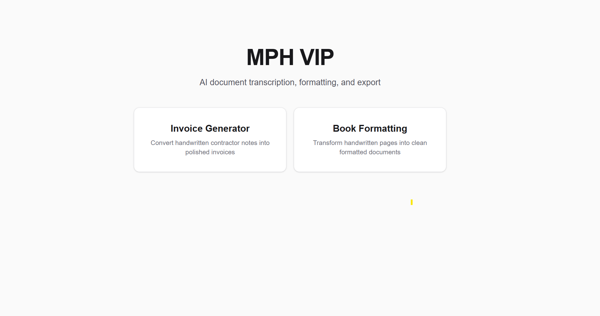
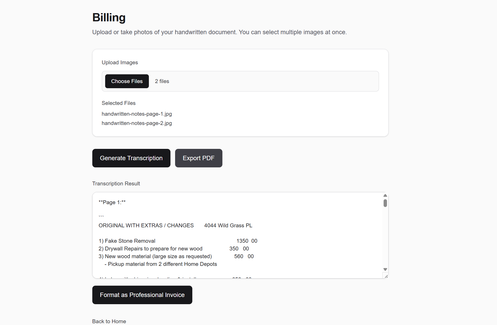
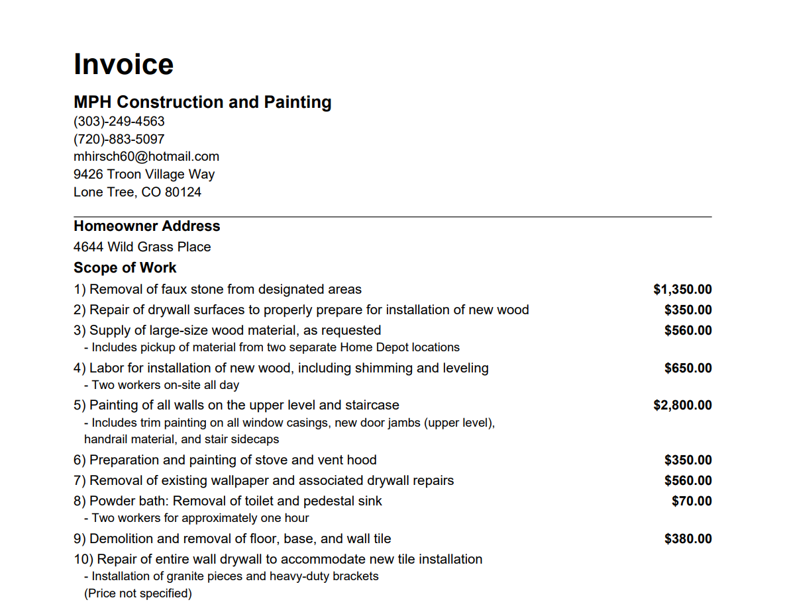
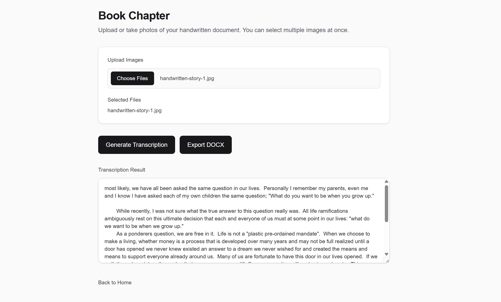
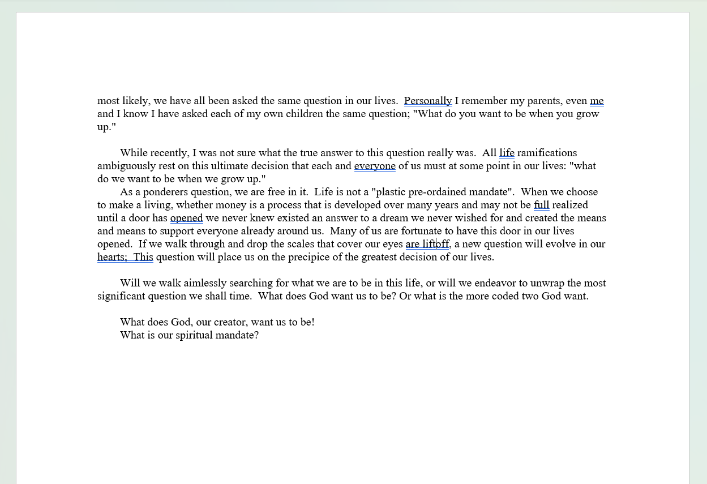

# MPH VIP

AI-powered document transcription and formatting tool for handwritten contractor notes and manuscript pages.

## Overview

MPH VIP converts handwritten images into clean digital documents using AI. The app supports two workflows:

- **Invoice Generator** - converts handwritten contractor notes into polished invoices with PDF export.
- **Book Formatting** - converts handwritten manuscript pages into clean formatted text with DOCX export.

## Features

- Multi-image upload
- AI transcription from handwritten notes
- Professional invoice formatting
- PDF export for billing documents
- DOCX export for book/manuscript pages
- Built for non-technical users and real field workflows

## Tech Stack

- Next.js
- TypeScript
- OpenAI API
- jsPDF
- docx
- file-saver
- Tailwind CSS

## Screenshots

### Home

### Invoice Workflow

### Generated Invoice PDF

### Book Formatting Workflow

### DOCX Export

## Purpose

This project was built as a practical AI workflow tool for converting handwritten documents into usable, client-ready outputs. It demonstrates applied prompt engineering, multimodal AI document processing, and export-focused document generation.

## Status

Portfolio MVP. Core workflows are functional.
